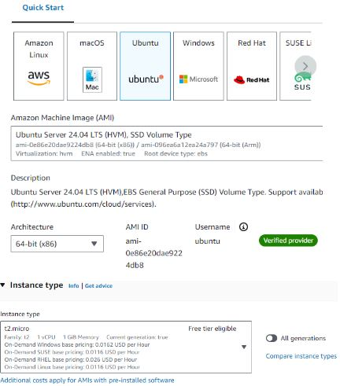
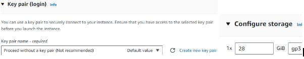
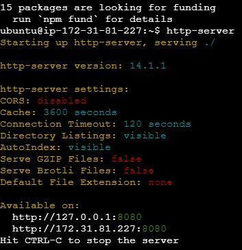
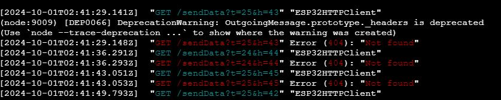

1. Connect a USB A to USB C cord from your computer to the ESP32. Plug in the white connector cord from the ESP32 to the DHT11 sensor. Open the Arduino program and open the DHT11 Default file from the class repository. Edit the ssid to the name of the wifi network you would like to connect to; change the password to the login password for the wifi network. 
2. Go to the sandbox environment on AWS academy under the ‘sandbox’ module, then click start lab; when the light goes green click it. Then in the new pop up window search ‘EC2’ and click on it. Then click on the orange button that says ‘launch instance’. From then on click Ubuntu, t2.micro, proceed without a key pair, and configure storage to 28 GiB, then click on the orange ‘launch instance’ button

3. Then click on the underlined portion of the green box like the one shown below.

4. Then select the instance line you would like to launch and then click ‘connect’, and then on the new page click ‘connect’. Next type the lines ’sudo apt update’, ‘sudo apt install nodejs’, ‘‘sudo apt install npm’ and ‘sudo npm install -g http-server’.
5. Type ‘http-server’ to start the server. Then make sure to go into your security groups and click on ‘edit inbound rules’. Then add a new rule with the port number you want to send from, make sure the port number in your code is the same one you are allowing in your security group. Make sure the source is 0.0.0.0/0

6. In your Arduino program with the DHT11 Default file open, in your AWS sandbox copy the public IP address and paste it into the code section on the DHT11 file that looks like "http://[Paster_here]:[Your_port#]/sendData" and again verify the port number is allowed by the security group.
7. Compile and upload your arduino code. Your final result should look like this:

