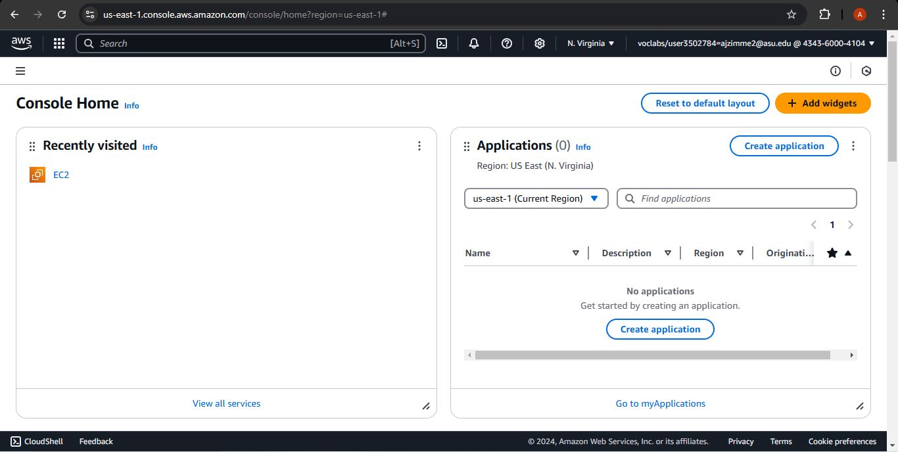
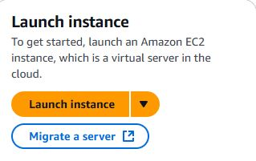
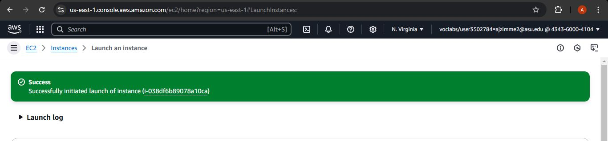
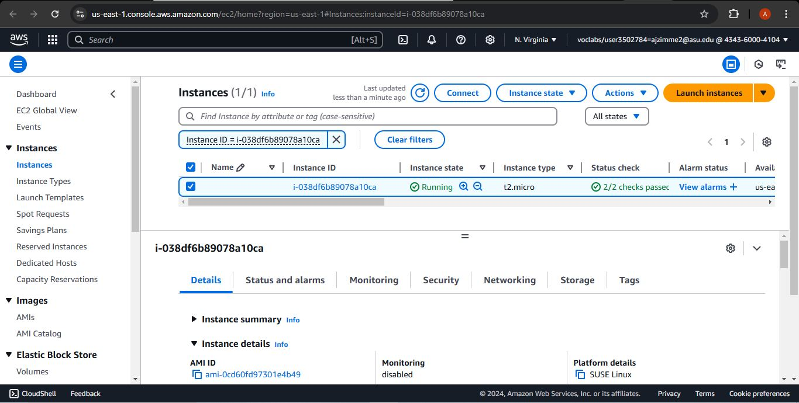
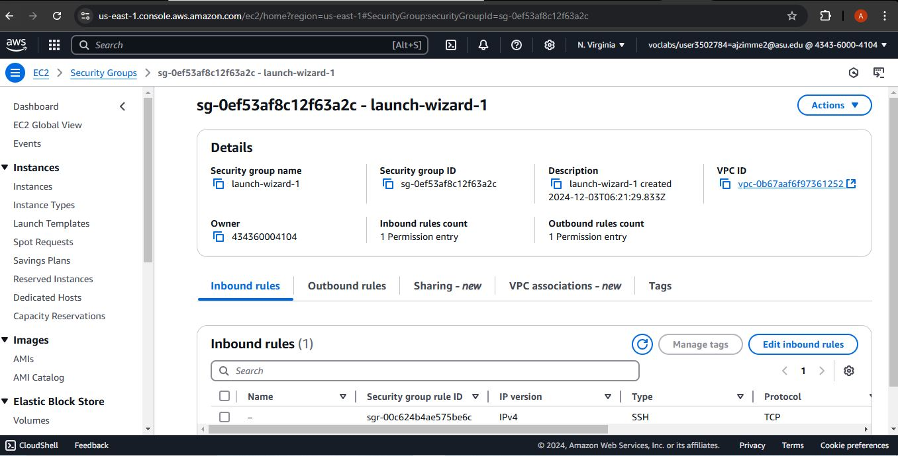
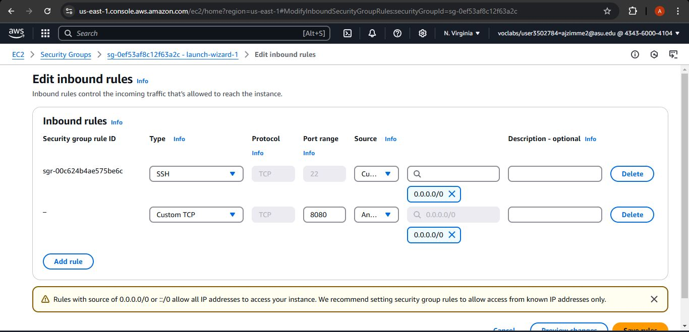
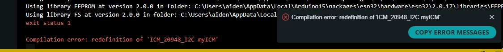

# AME498 Project - Home-made Golf Swing Sensor
## Summary of Project
The intent of the project is to create a cheap/affordable version of a golf swing sensor, since the currently available ones retail for hundreds to thousands of dollars. The main form for the project was mean for the sensor to be attached to the club, more towards the handle end, but not so far up that it would interfere with the use of the club. The project in its current state is **Unfinished** with the intent to eventually continue its development after the new year. Some of the roadblocks that have been encountered are mentioned in the *Improvements and Issues* section. It is recommended to readh through the entirety of the **Demos & Project File Descriptions** section to read more about the process development of my files. Overall, I forgot to keep track of the total man hours spent on the project, but it is enough to leave me burnt out for the continuation of this year. That also coincides with me having other finals to take care of during the last days of the project. 

## Installation Instructions
### Approach for Installation
Firstly, it is important that you, the user, has identified a method for serving the files contained within this repo to the internet. Whether that be through AWS or by other means, so be it. I will go through the steps of setting up and the installation through the AWS platform. 
1. Open AWS in your browsing window, and navigate to the Console Home page. 
[AWS_Console_Home](https://us-east-1.console.aws.amazon.com/console/home?region=us-east-1#)

2. Search and select **EC2**, then select the orange button labelled *Launch instance*.

3. The next steps will set up the instance parameters, change these based on need, but the key ones used for now will be under the following headers: **Application and OS Images**, **Key pair**, and **Configure Storage**.
    1. Under **Application and OS Images** select the *Ubuntu* option.
    2. Under **Key pair** select from the drop down menu, *proceed without key pair*.
    3. Under **Configure Storage** change the storage value to 28 GiB gp3.
    4. Then click the orange *Launch Instance* button on the lower right hand side.
4. After that, wait for the page to finish loading and then click on the link within the green box

5. From the new page, make sure the instance is selected by checking the box next to the instance name. Then press the connect button, then scroll down and press the connect button again.

6. In the next window that opens, the instance window, begin by pasting in the follwing code and pressing y and enter whenever prompted:
```
{
sudo apt-get install gnupg curl

curl -fsSL https://www.mongodb.org/static/pgp/server-8.0.asc | \
   sudo gpg -o /usr/share/keyrings/mongodb-server-8.0.gpg \
   --dearmor
   
echo "deb [ arch=amd64,arm64 signed-by=/usr/share/keyrings/mongodb-server-8.0.gpg ] https://repo.mongodb.org/apt/ubuntu noble/mongodb-org/8.0 multiverse" | sudo tee /etc/apt/sources.list.d/mongodb-org-8.0.list

sudo apt update
sudo apt-get install -y mongodb-org
sudo apt install nodejs npm 
sudo npm install -g forever http-server n

npm install mongodb@3.6
npm install cheerio
sudo service mongod start
}
```
7. Clone this repository into the instance environment. 
8. Next head back into the *Instances* window and select the instance, then scroll down and click on the *Security* tab. Click on the link that appears under the **Security Groups** header. 

9. On this new page, click the button that says *Edit inbound rules*, the *Add rule*, and change the port to *8080*, and specify the source to be *0.0.0.0/0* and then click save. 

10. Back in the instance window (where we have pasted lines of code), navigate through the repository to the file named *server.js* under the server folder. Then type in `node server.js`
11. This completes the relevant approach for installation.

## Usage Instructions
Navigate to the webage that has been established by running the `node server.js` command from step 11 in the *Approach for Installation* section and click on the connect button. After that select the bluetooth device (quatro) you want to connect (make sure your bluetooth on your computer is on) and click pair. From this point forward there is not a working product, but feel free to read through the Demos & Project File Descriptions section for more information on the files apart of this repository and the development process behind them. 

## Statement of Need(s)/Improvements and Issues
### Statement of Need(s)
The main drive behind this project has been to be able to provide a cost effective tool for individuals who do not have the same access to expensive equipment. This project was aimed to tackle that barrier, and provide it through open-source methods so that there is EQUAL access to all parties that want to take use of it. As a college student who has been trying to develop this, it makes perfect sense, since typical college students lack additional funds to spend on their hobbies and interests. Furthermore, youth of today have more experience with technology, so by providing this project through means they are more comfortable with (the internet, electronic devices, etc.) it also bridges the age gap for learning among golfers. 

### Improvements & Issues
#### Initial Device Connectivity 
##### Problem
The initial devices that I got from the AME tech lab did not seem to be able to connect with the Arduino program. I tested it on multiple peoples devices, thus confirming it was a problem with the device itself.
##### Solution
The professor was able to lend me his device, the Quatro, to help assist me in gathering the accelerometer and gyroscope data needed for my project.

#### Client to Server
##### Problem
I have had issues trying to pass the relevant data (accelerometer and gyroscope readings) to the server, mainly due to being unfamilar with the quatro's initial setup and used libraries.
##### Solution
Read up more about the various libraries the quatro uses to become familar with its syntax and dependencies. Furthermore, should consult with the professor on implementation of the client server connection.

#### Bluetooth
##### Problem
I had trouble connecting the quatro to bluetooth when I wanted to send the data to my server. Without the data I can not make the modifications I need and serve up the final product onto a webpage. 
##### Solution
Ask the professor more about the web bluetooth connection and try to research online about how it works so that there is I have a better understanding. 

#### Flashing the Quatro
##### Probelm 
I have tried to flash the Quatro with code, but it seems as though one of the libraries is causing it to error. 


### Future Outlook
If I could get all the pieces to work together as intended I could see this project expanding into further sports markets. It would be fun and beneficial to many to see this project adapted into baseball, disk golf, lacrosse, and other sports. I would assume that a baseball centered project would entail mostly the same details, same for lacrosse, but disk golf would need integration into a glove for the user to wear. 

## Demos & Project File Descriptions
### HTML
No demos were able to be completed for the project due to the inability to get the data necessary for testing. The closest thing to a demo is my testing of the graphing system I would like to have implemented for the visualization of the data, which can be found by locally running *plotAttempt.html*. Currently it only plots a few manually input datapoints. I was really excited to more further with the use of the plotting feature I selected since its versatility, but it did not see its time to shine. Furthermore, *Proj.html* attempted to model a golf club like object for part of the visualization, but sadly I was not able to get that running they way I wanted to. *index.html* is currently loaded with the html that was part of my last few attempts to mimic the 'quatro' webpage from the professor to see if I could get the bluetooth working, again. 

### Servers
*server.js* and *serverTEST.js* in their current states are parts of my attempts to create a working server to host on AWS that were not fruitful in getting bluetooth to work. I did have some success with replicating the look of the professor's 'quatro' webpage. *scrapeTEST.js* is a whole story on its own. It began with my belief that I could possibly extract all the information I needed for my project calculations from the professor's 'quatro' website "https://tejaswigowda.com/quatro/". In this rabbit hole that I fell down, I found out that it was much more difficult to scrape data from the webpage since the data was changing frquently, so I could not use just *cheerio* to pull that information. I did learn that pythons puppeteer might be the way for me to continue on, but at that point I had already sunk 10 hours into research and implementation of scraping, hoping that what I had already figured out was enough; it was not. 

### Accel-Gyro 
This file set contains my attempts at flashing the quatro, but it is not much to look at.

## AME498 FINAL video
[FINAL_Video](https://youtu.be/yx2Ro95dyIY)
